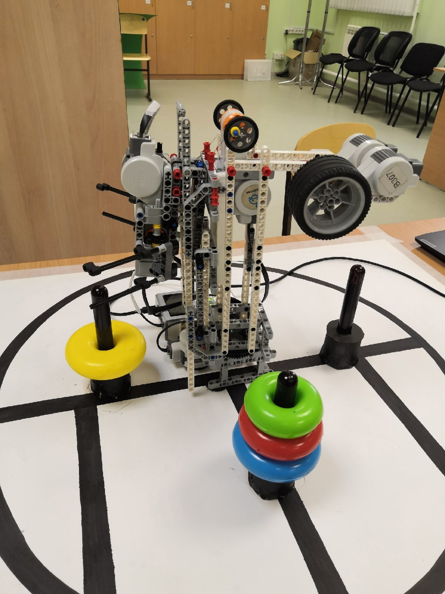

# Towers of Hanoi on EV3

## Abstract

A small project using LEGO EV3 MicroPython v2.0 to solve the Tower of Hanoi puzzle.

The program is launched using the EV3 block in the author's design of the robot. (Perhaps the design will be published later)

